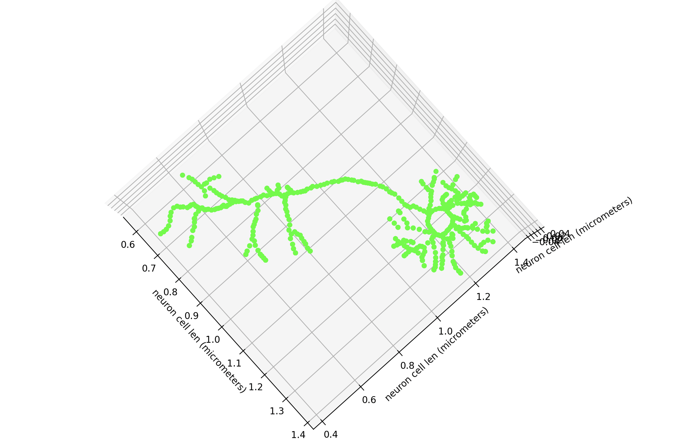

# Digital Twin Ultrasound Stimulation for Neurons
My goal in this project is to explore the dynamic interaction between ultrasound waves and neuronal action potentials, with the ultimate goal of developing a noninvasive device to enhance focus and memory. Initially, the project employs Python-based models to simulate neural behavior under ultrasonic stimulation. As I am contuning to work on this I plan to add AI to find the most optimal ultrasound parameters to stimulate the neurons!  

## initial ultrasound and neuron interaction model 
the inital model is very basic and only has one ultrasound pressure points and 6 neurons 

# DTUSN

